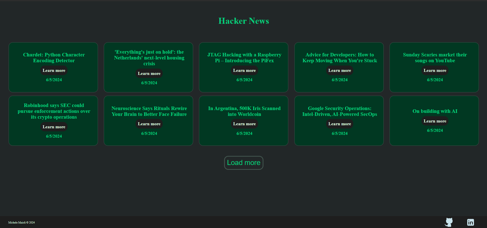

# Hacker News

This application allows you to know the last tech news, thanks to [Hacker News](https://github.com/HackerNews/API) service [Try it here!](//link al sito)

## Minimal Design

I chose this design because it's user friendly, with a simple grid of news that shows the title, the date an a link to the original news.

## Built With

- [JavaScript]()
- [HTML]()
- [CSS]()
- [Webpack]()

## Author

- [Linkedin](https://www.linkedin.com/in/michelemaioli)
- [Website](https://mic-9.github.io/)

## License

[MIT](https://choosealicense.com/licenses/mit/)
